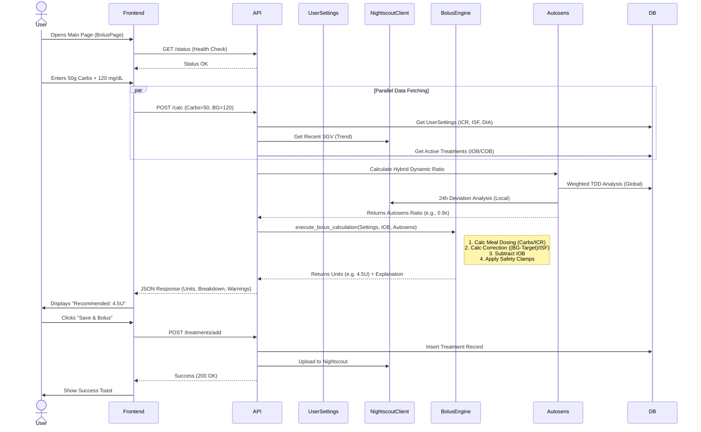
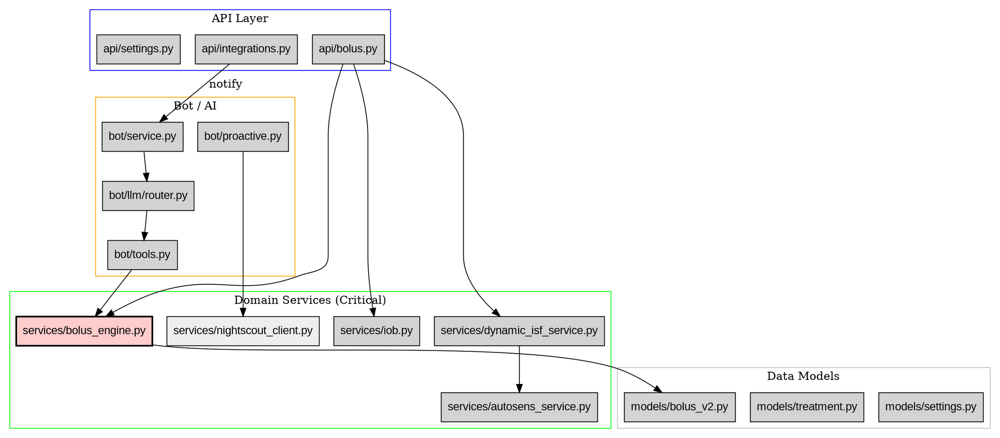

# BolusAI - Architecture Map & Data Flow Inventory
*Generated by Antigravity - January 03, 2026*

## 1. High-Level Architecture
**bolus_ai** is a hybrid monolithic application for diabetic management.
- **Frontend**: React/Vite PWA (UI for calculation, settings, history).
- **Backend**: FastAPI (Python) serving REST endpoints and managing background logic.
- **Bot**: Telegram Bot (Python-telegram-bot) acting as a proactive assistant and alternative UI.
- **Logic Core**: Deterministic Bolus Engine (Math-based) + Adaptive Logic (Autosens/Dynamic ISF).
- **Source of Truth**: Hybrid. Configuration in local SQLite; Glucose/Treatments synced with Nightscout.

---

## 2. Diagram 1: System Data Flow (Mermaid)

```mermaid
flowchart TD
    subgraph Sources [External Sources]
        User([User / Manual Input])
        NS[(Nightscout Cloud)]
        MFP[Health Auto Export / MFP]
        Dex[Dexcom/Libre via NS]
    end

    subgraph Interface [Interfaces Layer]
        UI[React Frontend]
        Bot[Telegram Bot]
        API[FastAPI Router]
    end

    subgraph Processing [Backend Processing]
        subgraph Ingestion
            Sync[Import Service]
            Hook[Integration Webhook]
        end

        subgraph Core_Services
            Bolus[Bolus Engine <br/>(Deterministic)]
            IOB[IOB/COB Calculator]
            Dyn[Dynamic ISF Service]
            Autosens[Autosens Service]
            Basal[Basal Engine]
        end

        subgraph Background
            Cron[APScheduler]
            Proactive[Proactive Rules]
            LLM[Gemini Router]
        end
    end

    subgraph Storage [Persistence]
        DB[(SQLite DB)]
        Cache[In-Memory Cache]
    end

    %% Flows
    User -->|POST /calc| API
    User -->|Chat / Commands| Bot
    Dex -->|SGV Entries| NS
    NS -->|Glucose/Treatments| Sync
    MFP -->|JSON POST| Hook
    Hook -->|Write| DB
    Hook -->|Notify| Bot

    Bot -->|Poll/Webhook| LLM
    LLM -->|Tool Call| API
    API -->|Read Settings| DB
    API -->|Get History| Sync
    Sync -->|Fetch| NS
    Sync -->|Cache| Cache

    API -->|Calculate| IOB
    IOB -->|Get Active Insulin| DB
    API -->|Get Ratio| Dyn
    Dyn -->|Get TDD| DB
    Dyn -->|Refine| Autosens
    Autosens -->|Analysis| NS

    API -->|Execute| Bolus
    Bolus -->|Result| API
    API -->|Response| UI
    Bolus -->|Input| Bot

    Cron -->|Trigger| Proactive
    Proactive -->|Check State| DB
    Proactive -->|Fetch Trend| NS
    Proactive -->|Send Alert| Bot
```

---

## 3. Diagram 2: Sequence - "Bolus Calculation Use Case"



---

## 4. Diagram 3: Module Dependency Map (DOT)



---

## 5. Inventory: INPUTS

| Canonical Name | Type | Source | Frequency | Norm/Validation | Criticality | Usage Location |
| :--- | :--- | :--- | :--- | :--- | :--- | :--- |
| **Current Glucose** | `int` (mg/dL) | User (Manual) OR Nightscout | On Calculate | None (Raw) | **Critical** | `api/bolus.py` -> `calculate_bolus` |
| **Carbs Input** | `int` (g) | User (Manual) Or Calculator | On Calculate | clamped >= 0 | **Critical** | `services/bolus_engine.py` |
| **Meal Slot** | `enum` | Frontend Time Selector | On Calculate | breakfast/lunch/dinner/snack | High | `models/settings.py` (selects ICR/ISF) |
| **ICR (Ratio)** | `float` | `UserSettings` (DB) | User Config | > 1 (Safety Guard) | **Critical** | `services/bolus_engine.py` |
| **ISF (Sensitivity)** | `float` | `UserSettings` (DB) | User Config | > 5 (Safety Guard) | **Critical** | `services/bolus_engine.py` |
| **History (IOB)** | `List[Treatment]`| DB + Nightscout | On Calculate | Filter < DIA hours | **Critical** | `services/iob.py` |
| **Autosens Factor**| `float` | `AutosensService` | On Calculate | Clamped (0.6 - 1.4) | Medium | `services/bolus_engine.py` |
| **Fiber/Fat/Prot** | `float` (g) | MFP/Health via Webhook | Event-based | Round to 1 decimal | Low | `bot/proactive.py`, `api/integrations.py` |
| **Trend Arrow** | `str` (Enum) | Nightscout | Every 5 min | "Flat", "DoubleUp", etc. | Medium | `services/forecast_engine.py` |
| **Active Insulin** | `float` (U) | Calculated (IOB) | Derived | >= 0 | High | `api/bolus.py` (Subtracts from suggestion) |

---

## 6. Inventory: OUTPUTS

| Output Name | Source Function | Condition | Destination | Risks |
| :--- | :--- | :--- | :--- | :--- |
| **Bolus Recommendation** | `BolusEngine.calculate_bolus_v2` | Always on valid inputs | UI (Result Card) | Hypoglycemia if input (BG/Carbs) is wrong. |
| **Units Breakdown** | `BolusEngine` | On Rec | UI (Explanation) | Confusion if negative correction not explained. |
| **Calculated IOB** | `IOBService.calculate_iob` | On Calc or Status | UI & Bot | Stacking insulin if previous treatments missing. |
| **Trend Alert** | `Proactive.trend_alert` | Slope > X or < -Y | Telegram Bot | Notification fatigue (Spam). |
| **Meal Detection** | `Integrations.ingest_nutrition` | Webhook Payload | Telegram Bot (Verify) | Duplicate alerts if Sync vs Webhook overlap. |
| **Autosens Advisor** | `AutosensService.calculate` | Delta > Threshold | UI & Bot | User accepts bad ISF change if logic flawed. |
| **Treatment Record** | `API.save_treatment` | User Validates UI/Bot | DB & Nightscout | Data loss if Nightscout offline & DB write fails. |

---

## 7. Processes & Workers Inventory

1.  **Telegram Polling (`service.py`)**:
    *   *Type:* Long-running async task.
    *   *Trigger:* Telegram updates (messages, callbacks).
    *   *Action:* Routes to `llm/router.py`, executes tools, sends replies.

2.  **Autosens Background Check (`api/bolus.py`)**:
    *   *Type:* `BackgroundTasks` (FastAPI).
    *   *Trigger:* After every `/calc` request.
    *   *Action:* Runs `AutosensService`, if suggestions found -> DB write + Bot Alert (Buttons Included).

3.  **Proactive Scheduler (`scheduler`)**:
    *   *Type:* Cron-like intervals (APScheduler).
    *   *Jobs:*
        *   `check_glucose` (5 min): Runs `trend_alert`.
        *   `basal_reminder` (Daily/Scheduled): Checks if basal entered.
        *   `morning_msg` (8:00 AM): Summary.

4.  **Nutrition Sync Hook (`api/integrations.py`)**:
    *   *Type:* ISO Webhook Endpoint, supports Health Auto Export.
    *   *Trigger:* iOS Shortcuts / Health Auto Export.
    *   *Action:* Parses JSON, Deduplicates (Time/Macros), Saves `Treatment` (insulin=0), Calls `bot.on_new_meal_received`.

---

## 8. Identified Risks & Points of Attention (Grey Zones)

1.  **Crucial Dependency on Nightscout**: Even with a local DB, `IOBService` and `AutosensService` heavily prioritize Nightscout data. If NS is down or slow, calculations may fallback to potentially incomplete local data (Cold Start risk). **[PARTIALLY MITIGATED: Dynamic ISF now has self-defense 1.0 fallback]**.
2.  **Duplicate Meal Entry [CORRECTED]**: The `integrations.py` dedup logic uses a 10-minute window and fuzzy macro matching (+/- 2g). Logic updated to be robust against minor numeric differences.
3.  **Bot <-> API Coupling [CORRECTED]**: The `Proactive` modules heavily duplicated Nightscout logic. **Refactored** to use a centralized `get_nightscout_client()` factory in `services/nightscout_client.py`.
4.  **Timezone Naivety [CORRECTED]**: The ingestion service previously forced naive datetimes blindly. **Updated** to attempt smart localization (e.g. Europe/Madrid fallback) before UTC conversion to prevent "Ghost Carbs".
5.  **Dynamic ISF Safety [CORRECTED]**: The "Hybrid" ISF logic relies on mathematical derivation. **Added Guardrails**: If TDD deviates >30% from 7-day average (suggesting missing data), the system forces a neutral 1.0 ratio and warns the user.
