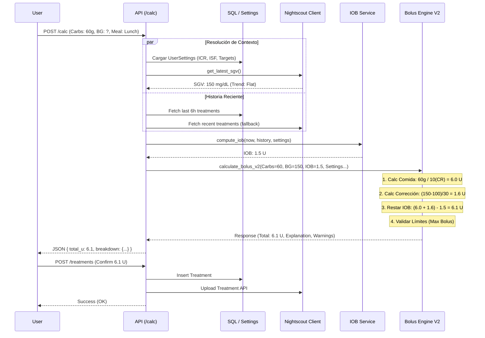
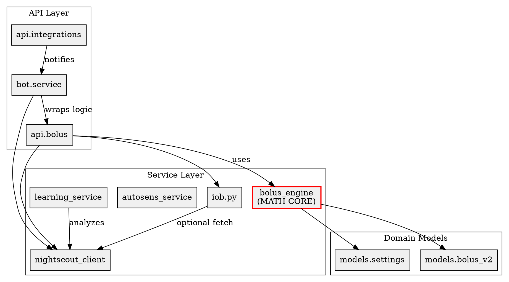

# Mapa Visual y Arquitectura de Bolus AI

Fecha de actualización: 2026-01-02
Versión del análisis: 1.0

## 1. Resumen de Arquitectura

**bolus_ai** es un sistema híbrido de cálculo de insulina y asistente personal ("Loop Helper"). Su núcleo es una API FastAPI que orquesta datos de **Nightscout** (glucosa/historial), **Health Integration** (Apple Health/Shortcuts) y **User Input** (Bot/App). 

El motor matemático (`bolus_engine.py`) es determinista y stateless, separando la lógica de cálculo (seguridad crítica) de la capa de IA (Bot/LLM). El sistema incluye un programador de tareas (`APScheduler`) para vigilancia proactiva (alertas de hipo, recordatorios de basal) y utiliza una base de datos SQL (SQLite/Postgres) como fuente de verdad local, sincronizándose bidireccionalmente con Nightscout.

---

## 2. Diagramas de Flujo

### A) Dataflow Completo (Macro Arquitectura)

```mermaid
flowchart TD
    subgraph Sources [Fuentes de Datos]
        NS[Nightscout API] -->|SGV / Treatments / Profile| NSClient
        User[Usuario] -->|Voz / Texto / UI| BotUI
        Health[iOS Health / Shortcuts] -->|JSON Webhook| Integrations
    end

    subgraph Backend [Backend API (FastAPI)]
        RouterBolus[Router: /api/bolus]
        RouterInt[Router: /api/integrations]
        RouterBot[Bot Service]
    end

    subgraph Services [Servicios Core]
        NSClient[Nightscout Client]
        IOBService[IOB Engine]
        BolusEng[Bolus Engine V2 (Math)]
        Autosens[Autosens Service]
        Vision[Gemini Vision API]
    end

    subgraph Storage [Persistencia]
        DB[(SQL Database)]
        SettingsStore[User Settings]
    end

    subgraph Background [Procesos]
        Cron[APScheduler Jobs]
        Guardian[Guardian Monitor]
        Learner[Learning Service]
    end

    %% Flujos
    User -->|POST /calc| RouterBolus
    User -->|Comandos| RouterBot
    Health -->|POST /nutrition| RouterInt
    
    RouterInt -->|Normaliza & Guarda (Orphan)| DB
    RouterInt -.->|Trigger Event| RouterBot
    
    RouterBot -->|Consulta| IOBService
    RouterBot -->|Consulta| NSClient
    RouterBot -->|Analizar Imagen| Vision

    RouterBolus -->|Get SGV| NSClient
    RouterBolus -->|Get Activity| IOBService
    RouterBolus -->|Fetch Ratio| Autosens
    RouterBolus -->|Config| SettingsStore
    
    IOBService -->|Lee Tratamientos| DB
    IOBService -->|Lee Tratamientos| NSClient
    
    RouterBolus -->|Inputs Unificados| BolusEng
    BolusEng -->|Dosis Calc & Warnings| RouterBolus
    
    %% Outputs
    RouterBolus -->|Respuesta JSON| User
    User -->|POST /treatments (Confirm)| RouterBolus
    RouterBolus -->|Log Treatment| DB
    RouterBolus -->|Upload| NSClient
    NSClient -->|Write| NS

    %% Background
    Cron -->|Trigger| Guardian
    Guardian -->|Check SGV| NSClient
    Guardian -->|Alert| RouterBot
    RouterBot -->|Telegram Msg| User
    
    Cron -->|Analyze Outcomes| Learner
    Learner -->|Read History| DB
```

### B) Sequence: Caso de Uso "Cálculo de Bolo"



### C) Mapa de Dependencias de Módulos (Graphviz)



---

## 3. Inventario de INPUTS (Entradas de Datos)

| Nombre Canónico | Tipo | Fuente | Frecuencia | Validación / Guardrails | Uso Principal | Impacto / Riesgo de Fallo |
| :--- | :--- | :--- | :--- | :--- | :--- | :--- |
| **Glucosa (SGV)** | mg/dL (float) | Nightscout (Primary) / Manual (UI) | Cada calc / 5min | Stale check (>10min = stale). Warning si <30 o >500. | `calculate_bolus_v2` (Corrección) | Fallback a Corrección=0. Riesgo de omitir hipo. |
| **Carbohidratos** | gramos (float) | UI Manual / Bot / iOS Health Webhook | Puntual (Comida) | Must be >= 0. | `calculate_bolus_v2` (Meal Bolus) | Error directo en cálculo. |
| **Settings (ICR/ISF)**| float | DB (`UserSettings`) / Payload override | Cada calc | CR > 0.1, ISF > 5. | `calculate_bolus_v2` | **CRÍTICO**. Divisor del cálculo (Seguridad 1). |
| **Historial (IOB)** | Lista[Eventos] | DB (`entries`) + Nightscout | Cada calc | Filtrado por ventana DIA (4-6h). | `iob.py` -> `compute_iob` | Si vacío: IOB=0 -> Riesgo de "Stacking" (Hipoglucemia). |
| **Autosens Impact** | Ratio (float) | `AutosensService` (Analysis) | Background diario | Clamp Safe (0.7 - 1.3). default=1.0. | `calculate_bolus_v2` (Advisory) | Altera sugerencia +/- 30%. Riesgo medio. |
| **Alcohol Mode** | bool | UI (Toggle) | Manual | N/A | `calculate_bolus_v2` | Reduce correcciones para evitar hipos tardías. |
| **Exercise** | {min, intensity} | UI (Form) | Manual | Factor reducción max 90%. | `calculate_bolus_v2` | Reduce bolo total preventivamente. |
| **Nutrition Payload** | JSON | Webhook (Health/Shortcuts) | Puntual | Dedup logic (timestamp/macros). | `api.integrations` -> DB | Alimenta "Orphan treatments" para log/aviso. |

---

## 4. Inventario de OUTPUTS

| Output | Productor | Condición | Destino |
| :--- | :--- | :--- | :--- |
| **Dosis Total (U)** | `bolus_engine.py` | Siempre (puede ser 0) | UI (Display) / Log DB |
| **Bolo Desglose** | `bolus_engine.py` | Siempre | UI (Explicación "Why") |
| **Suggestion (ISF)** | `autosens_service.py` | Ratio desvía > 5% | DB (`Suggestions`) + Bot Alert |
| **Bot Notification** | `bot.service` | Webhook Nutrición / Alerta Guardian | Telegram Chat |
| **Nightscout Treatment** | `api.bolus` | Confirmación Usuario | Nightscout API (Upload) |
| **Warning Flags** | `bolus_engine.py` | Hipo (<70), IOB Negativo, Stale Data | UI (Badges/Alerts) |

---

## 5. Procesos Background y Workers

| Nombre | Trigger (Scheduler) | Función | Descripción |
| :--- | :--- | :--- | :--- |
| **Guardian Check** | Cada 5 min | `bot.service.run_glucose_monitor_job` | Lee SGV de NS. Si < Rango, envía alerta urgente a Telegram. |
| **Night Scan** | Diario 07:00 | `jobs.run_auto_night_scan` | (Placeholder) Escanea métricas nocturnas. |
| **Data Cleanup** | Diario 04:00 | `jobs.run_data_cleanup` | Borra tratamientos antiguos (>90 días) de SQL local. |
| **Learning Eval** | Cada 30 min | `jobs.run_learning_evaluation` | Evalúa resultados de bolos pasados y guarda outcome. |
| **Proactive Nudges** | Intervalos (30/45m) | `bot.proactive.*` | Premeal nudge, Basal reminder. |

---

## 6. Mapa de Estados del Sistema

*   **Runtime State (Volátil)**: 
    * IOB actual instantáneo (se recalcula en cada petición).,
    * Estado de conexión con Nightscout (vivo/muerto).
    * `SNAPSHOT_STORAGE` en memoria para callbacks de Bot (botones interactivos).

*   **Persistent State (Base de Datos)**:
    * `User Settings`: Fuente de verdad de ratios y factores.
    * `Treatments`: Historial local sincronizado.
    * `Nightscout Secrets`: Tokens de acceso cifrados.
    * `Suggestions`: Sugerencias pendientes de aprobación.

---

## 7. Análisis de Riesgos y Puntos de Dolor

1.  **Riesgo de Data Gap (Stacking):** 
    *   *Problema:* Si Nightscout no responde y la DB local está vacía (ej. tras reinstalación limpia), el sistema calcula IOB = 0, lo cual es peligroso si el usuario se inyectó hace 1 hora.
    *   *Mitigación:* Se recomienda warning "IOB DESCONOCIDO" si no hay historial > 4h.

2.  **Dependencia de Webhook (Integrations):**
    *   *Problema:* La estructura del JSON que envían Apps de terceros (Auto Export, Shortcuts) cambia sin aviso.
    *   *Mitigación:* El endpoint es "silencioso" (loguea errores sin tirar 500 al cliente) pero puede perder datos de entrada.

3.  **Timezones (Naive vs Aware):**
    *   *Problema:* El código actual mezcla `datetime.now(utc)` con fechas "naive" de SQLite.
    *   *Impacto:* Posibles errores en cálculo de decaimiento de insulina (IOB) o en visualización de gráficos.

4.  **Math acoplado a Payload API:**
    *   *Problema:* `calculate_bolus_v2` recibe el objeto `BolusRequestV2`. 
    *   *Mejora:* Sería más higiénico que `bolus_engine` recibiera solo dataclasses puras, desacoplando la capa HTTP de la lógica de dominio.

5.  **Autenticación Bot:**
    *   *Seguridad:* Depende de `ALLOWED_TELEGRAM_USER_ID`. Si no se configura, el bot podría estar expuesto o inactivo. Es un modelo monousuario hardcodeado por diseño.
