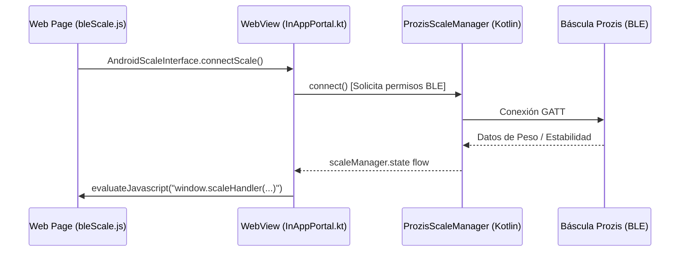

# Puente Bluetooth Nativo a JS y Permisos de Cámara en Android WebView

Este documento detalla la implementación técnica realizada en la app Android Companion y el frontend de Bolus AI para solucionar las siguientes limitaciones del componente `WebView` de Android:
1. **Falta de soporte para Web Bluetooth API**: Los navegadores embebidos (`WebView`) de Android carecen de soporte nativo para `navigator.bluetooth`.
2. **Acceso a cámara en subida de archivos**: La selección de archivos mediante `<input type="file" capture="environment">` genera un intento de captura de cámara que requiere declarar y solicitar el permiso nativo de cámara en tiempo de ejecución.

---

## ⚖️ 1. Puente Bluetooth Prozis (JS Bridge)

Para conectar la báscula Prozis nativamente desde la interfaz web, elevamos el controlador de Bluetooth al nivel de la app y creamos un puente de comunicación bidireccional entre Kotlin y JavaScript.



### Componentes Modificados

### A. Backend & Frontend: [bleScale.js](file:///E:/projects/bolus_ai/frontend/src/lib/bleScale.js)
Modificamos el archivo principal de Bluetooth en el frontend para delegar el flujo de conexión al puente nativo de Android si se detecta su presencia (`window.AndroidScaleInterface`):
- **Soporte de Bluetooth**: `isBleSupported()` ahora retorna `true` si `window.AndroidScaleInterface` existe, aunque `navigator.bluetooth` sea nulo.
- **Llamadas del Puente**: Las funciones `connectScale()`, `disconnectScale()` y `tare()` detectan si están corriendo en Android y delegan a la interfaz del puente en lugar de interactuar directamente con `navigator.bluetooth`.

### B. App Android: [MainActivity.kt](file:///E:/projects/bolus_ai/android-companion/src/main/java/org/bolusai/companion/MainActivity.kt)
- Elevamos (hoist) la instancia única de `ProzisScaleManager` en la inicialización de `BolusCompanionApp`.
- Pasamos esta instancia tanto a la pantalla de configuración nativa como a `InAppPortal` para que compartan el mismo estado de conexión.

### C. App Android: [InAppPortal.kt](file:///E:/projects/bolus_ai/android-companion/src/main/java/org/bolusai/companion/portal/InAppPortal.kt)
- **Definición de Interfaz**: Implementamos la clase `AndroidScaleInterface` anotada con `@JavascriptInterface` exponiendo los métodos `connectScale()`, `disconnectScale()` y `tare()`.
- **Inyección en WebView**: Registramos la interfaz mediante `addJavascriptInterface(androidScaleInterface, "AndroidScaleInterface")`.
- **Propagación de Estado**: Añadimos un `LaunchedEffect` en Compose que observa los cambios del `StateFlow` (`scaleManager.state`). Cuando cambian el peso en gramos, la estabilidad o el estado de conexión, se evalúa código JS en el WebView:
  ```kotlin
  val js = "if (window.scaleHandler) { window.scaleHandler($json); }"
  view.evaluateJavascript(js, null)
  ```

---

## 📷 2. Permisos de Cámara en WebView

Cuando la aplicación web solicita una captura de cámara a través de un diálogo de selección de archivos (por ejemplo, al tomar fotos de comida/platos en el Modo Restaurante), el sistema requiere que la app declare los permisos y los solicite dinámicamente si el usuario genera un intent de captura de fotos.

### Componentes Modificados

### A. Manifiesto: [AndroidManifest.xml](file:///E:/projects/bolus_ai/android-companion/src/main/AndroidManifest.xml)
Añadimos la declaración del permiso de cámara a nivel de sistema:
```xml
<uses-permission android:name="android.permission.CAMERA" />
```

### B. Intercepción en WebView: [InAppPortal.kt](file:///E:/projects/bolus_ai/android-companion/src/main/java/org/bolusai/companion/portal/InAppPortal.kt)
- Implementamos un `WebChromeClient` personalizado y sobrescribimos `onShowFileChooser`.
- **Detección de Captura**: Si los parámetros del archivo indican que se requiere captura de cámara (`fileChooserParams.isCaptureEnabled`), detenemos el flujo estándar e interceptamos la petición.
- **Petición en Tiempo de Ejecución**: Comprobamos si la aplicación ya tiene concedido el permiso `Manifest.permission.CAMERA`. Si no lo tiene, disparamos `cameraPermissionLauncher` para solicitarlo al usuario.
- **Retorno del Callback**: Al concederse el permiso, delegamos el intent de la cámara a `filePicker` para que retorne el archivo capturado de forma transparente al WebView. Si el permiso es denegado, cancelamos el callback del WebView (`fileCallback?.onReceiveValue(null)`) de forma segura para evitar bloqueos en el navegador.

---

## 🧪 3. Plan de Verificación y Testing

### Verificación Nátiva (Android)
1. **Compilación**: Asegurar que la app compila correctamente mediante `.\gradlew.bat :android-companion:assembleDebug`.
2. **Cámara**: Abrir la sección de escanear plato en la app, pulsar la cámara y verificar que Android muestra el prompt de solicitud de permisos y que la cámara abre correctamente.
3. **Báscula**: Asegurar que al pulsar en "Conectar" se solicitan permisos de Bluetooth (en Android 12+), busca y se enlaza con la báscula Prozis nativamente.

### Despliegue del Frontend
Para que las modificaciones en el JavaScript funcionen en dispositivos móviles reales que se conectan de forma remota, el NAS debe estar actualizado a la última rama para que sirva los estáticos recompilados en `backend/app/static`.
