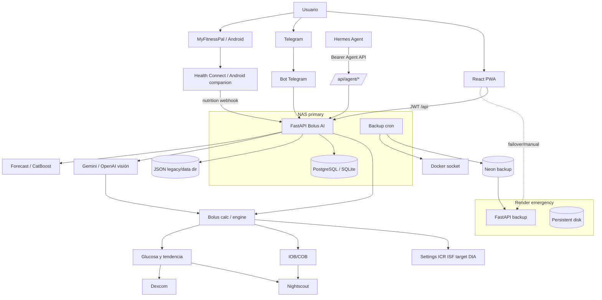

# Auditoría técnica completa de Bolus AI (2026)

**Fecha:** 2026-07-11
**Repositorio:** `DanielGTdiabetes/bolus_ai`
**Commit auditado:** rama `main`, copia obtenida el 2026-07-11
**Alcance:** análisis estático integral y ejecución local aislada de pruebas/build.
**Regla aplicada:** no se modificó código de producción, no se eliminó ningún archivo y no se aplicaron correcciones de dependencias.

> Bolus AI influye en decisiones sobre insulina. Esta auditoría no valida clínicamente fórmulas ni convierte el software en producto sanitario. Las fórmulas y umbrales requieren revisión clínica humana y pruebas de caracterización antes de modificarse.

## 1. Resumen ejecutivo

Bolus AI es un sistema funcional y ambicioso, con una red de seguridad considerable (295 tests Python), separación parcial entre API, servicios y modelos, autenticación general en las rutas clínicas y una Agent API explícitamente `estimate-only`. Sin embargo, el estado actual **no es apto para despliegue sin una fase de estabilización**: la suite principal no está verde, existen secretos aparentemente reales en scripts versionados, hay defaults inseguros de administración/despliegue y varias regresiones afectan flujos clínicos o su contexto.

Resultado general: **riesgo alto controlable**. No se observó código que administre insulina físicamente. Sí existen rutas que persisten tratamientos y los suben a Nightscout tras una acción autenticada, además de callbacks Telegram que aceptan recomendaciones. La Agent API de estimación no persiste ni sube tratamientos en el camino revisado, pero depende de settings con fallbacks y silenciamiento de excepciones que reducen trazabilidad.

Principales prioridades:

1. **P0:** revocar y eliminar del historial los tokens aparentemente reales presentes en scripts; eliminar defaults de contraseña/secretos y fallar cerrado en producción.
2. **P1:** recuperar suite verde, empezando por deduplicación nutricional, snapshots Telegram y onset/simulación de pronóstico.
3. **P1:** impedir secretos en query strings y payloads clínicos completos en logs persistentes.
4. **P1:** caracterizar y revisar los defaults clínicos silenciosos (`ISF=30`, `ICR=10`, target fijo y ausencia opcional de límites de stacking/IOB).
5. **P2:** unificar migraciones, configuración y fuentes de verdad; reducir módulos monolíticos y artefactos de diagnóstico versionados.

## 2. Estado general del proyecto

| Área | Estado | Evidencia resumida |
|---|---|---|
| Backend | Funcional con regresiones | FastAPI + SQLAlchemy async; 7 fallos y 3 errores en pytest |
| Cálculo clínico | Amplio, con guardrails parciales | límites, warnings, IOB/COB y redondeo; defaults silenciosos y pruebas rojas |
| Agent API | Diseño correcto, endurecimiento pendiente | token/IP, estimación sin persistencia; fallback de settings y secreto compartido en NAS |
| Frontend | Compila | build Vite correcto; un test clínico de payload falla; token JWT en `localStorage` |
| Android companion | Activo | Health Connect, Dexcom, cola Room, SecretStore, workers; Gradle no ejecutado |
| Persistencia | Compleja | PostgreSQL/SQLite + JSON legacy + Alembic + DDL manual de arranque |
| Integraciones | Amplias, acopladas | Nightscout, Dexcom, Telegram, Gemini/OpenAI, Hermes/MyFitnessPal |
| Despliegue | NAS primary + Render backup | Compose NAS, Render, scripts de backup/migración |
| Seguridad | Insuficiente para exposición pública sin cambios | secretos versionados, defaults débiles, query token, contenedores root |
| Documentación | Extensa pero divergente | stack/versiones y contratos no siempre coinciden con código/tests |

## 3. Mapa de arquitectura real

### Inventario

- **Python 3.11/3.12:** FastAPI, Pydantic 2, SQLAlchemy async, asyncpg/aiosqlite, APScheduler, Telegram Bot, CatBoost, clientes Nightscout/Dexcom y visión.
- **Frontend:** React 19, Vite 7, wouter, Recharts; SPA compilada y copiada a `backend/app/static`.
- **Android:** Kotlin/Gradle, Health Connect, Room/colas, Accessibility Service para MyFitnessPal, receptor Dexcom y workers.
- **Entrypoints:** `backend/app/main.py`, `backend/start.sh`, `render_start.sh`, Dockerfiles, `frontend/src/main.js`, `android-companion/.../MainActivity.kt`.
- **Datos:** PostgreSQL en NAS y Neon/Render; SQLite en tests/fallback; JSON legacy en `DATA_DIR`; modelos CatBoost persistidos en disco/DB.
- **Programación:** APScheduler en `backend/app/jobs.py`, tareas startup, workers Android, backup NAS y unidades Hermes.
- **Despliegues:** Compose local, Compose NAS/Portainer, Render; PostgreSQL expuesto por Compose NAS; contenedor backup con Docker socket.
- **CI:** no se encontraron workflows en `.github/workflows` en la copia auditada.



### Flujo real de estimación

`BolusRequestV2` → resolución de settings DB/JSON/overrides → glucosa/IOB/COB desde DB y Nightscout → autosens/filtros → `calculate_bolus_v2` → componentes comida/corrección/grasa-proteína/fibra/ejercicio → topes/redondeo/warnings → respuesta. La persistencia es un flujo distinto (`POST /api/bolus/treatments`) que puede escribir localmente y en Nightscout.

## 4. Hallazgos críticos

### SEC-001 — Secretos aparentemente reales versionados

- **Severidad/prioridad:** crítica, P0; corrección necesaria.
- **Categoría:** secretos.
- **Ubicación:** `backend/verify_fix_headers.py:11`, `backend/test_fix.py:15`, `backend/test_fix_query.py:15`, `backend/test_fix_query_no_json.py:15`, `backend/test_default_sort.py:13`, `backend/test_sort.py:12`.
- **Descripción/evidencia:** el mismo token con formato Nightscout aparece hardcodeado y algunos scripts lo imprimen. Se enmascara aquí como `app-7f…5c7`; no se verifica si sigue activo.
- **Impacto/probabilidad:** compromiso de Nightscout o acceso a datos/tratamientos si está activo; probabilidad alta de exposición histórica.
- **Propuesta:** revocación inmediata, rotación, búsqueda en historial Git y logs, purga del historial coordinada, secrets scanner en CI; scripts solo mediante variables de entorno.
- **Riesgo de propuesta:** rotación rompe clientes no actualizados; coordinar despliegues.
- **Pruebas necesarias:** confirmar que token viejo devuelve 401/403 sin mostrarlo; smoke de clientes con nuevo secreto.
- **Esfuerzo/confianza:** medio / alta.

### SEC-002 — Credenciales administrativas y de base de datos con defaults inseguros

- **Severidad/prioridad:** crítica, P0; corrección necesaria.
- **Ubicación:** `backend/app/services/auth_repo.py:40`, `docker-compose.yml:12`, `deploy/nas/docker-compose.yml:66`.
- **Evidencia:** contraseña inicial por defecto `admin123`; JWT local por defecto `please-change-this-secret`; PostgreSQL NAS por defecto `password` y puerto publicado.
- **Impacto/probabilidad:** toma de cuenta, falsificación JWT o acceso DB si se despliega sin `.env` correcto; alta en instalaciones manuales.
- **Propuesta:** sin defaults de producción, bootstrap de contraseña aleatoria de un solo uso, validación fail-closed y DB no publicada salvo necesidad explícita.
- **Riesgo/pruebas/esfuerzo/confianza:** puede impedir arrancar instalaciones mal configuradas; tests de startup negativo y despliegue; pequeño-medio / alta.

## 5. Hallazgos altos

### CLIN-001 — Suite roja en deduplicación de comida importada

- **Severidad/prioridad:** alta, P1; corrección necesaria y validación clínica.
- **Ubicación:** `backend/app/api/integrations.py:574-1225`; `backend/tests/test_integrations_nutrition.py:455`.
- **Evidencia:** una comida Hermes reciente equivalente no se deduplica; se crea otro tratamiento de 27.2 g (`ingested_count=1`, esperado 0).
- **Impacto/probabilidad:** COB/carbohidratos duplicados, notificaciones y posibles estimaciones de bolo erróneas; alta en dumps MyFitnessPal/Health Connect.
- **Propuesta:** caracterizar claves (fingerprint, slot, tiempo, tolerancia de macros), deduplicación transaccional e índice/idempotency key.
- **Riesgo/pruebas/esfuerzo/confianza:** falsos positivos podrían ignorar comida real; matrices temporales/DST/concurrencia; medio / alta.

### CLIN-002 — Simulación/pronóstico aplica onset de forma inconsistente

- **Severidad/prioridad:** alta, P1; corrección necesaria, validación clínica.
- **Ubicación:** `backend/app/api/forecast.py`; `backend/tests/test_forecast_onset.py:63`; `frontend/tests/simulation_payload.test.js:20`.
- **Evidencia:** el bolo actual de offset 0 muta a +15 min contra el contrato del test; el payload frontend no incluye bolos históricos y actuales esperados.
- **Impacto/probabilidad:** curva de pronóstico temporalmente desplazada o incompleta, con riesgo de interpretación de hipo/hiper futura; alta al usar simulación.
- **Propuesta:** fijar contrato inmutable de offsets y fuente única de bolos; pruebas golden backend/frontend con onset 0/15, históricos/futuros y zonas horarias.
- **Riesgo/pruebas/esfuerzo/confianza:** cambiar fórmula sin consenso altera resultados; medio / alta.

### CLIN-003 — Estado snapshot de Telegram desalineado con tests/callbacks

- **Severidad/prioridad:** alta, P1; corrección necesaria.
- **Ubicación:** `backend/app/bot/service.py`, `backend/app/bot/snapshot_store.py`; tests de callbacks y ejercicio.
- **Evidencia:** `service.SNAPSHOT_STORAGE` ya no existe; 3 errores de setup y 2 fallos derivados. Los tests verificaban identidad de usuario, macros y aceptación manual.
- **Impacto/probabilidad:** pérdida del contexto entre recomendación y aceptación/edición; riesgo de aplicar macros o usuario equivocados; media-alta.
- **Propuesta:** definir interfaz única de snapshots, migrar callbacks/tests conjuntamente y añadir expiración, ownership y concurrencia.
- **Riesgo/pruebas/esfuerzo/confianza:** restaurar el global ocultaría la arquitectura nueva; tests E2E Telegram; medio / alta.

### SEC-003 — Secretos de ingestión aceptados en query string

- **Severidad/prioridad:** alta, P1; corrección necesaria.
- **Ubicación:** `backend/app/api/integrations.py:650-662`.
- **Evidencia:** acepta `?key=...`; URLs se registran en proxies, historial y telemetría. Comparación usa `==`, no comparación constante.
- **Impacto/probabilidad:** fuga del webhook key y creación de comidas/tratamientos huérfanos; alta si se usa integración legacy.
- **Propuesta:** header firmado o bearer exclusivamente; ventana de migración, rate limit y `hmac.compare_digest`.
- **Riesgo/pruebas/esfuerzo/confianza:** rompe clientes antiguos; pequeño / alta.

### SEC-004 — Payload nutricional clínico completo persistido en logs JSON

- **Severidad/prioridad:** alta, P1; corrección necesaria.
- **Ubicación:** `backend/app/api/integrations.py:598-631`.
- **Evidencia:** `log_entry` guarda `"payload": payload` en `ingest_logs.json` (50 entradas), incluyendo alimentos, cantidades y timestamps.
- **Impacto/probabilidad:** exposición de datos de salud, retención no documentada y acceso fuera de DB/auth; alta.
- **Propuesta:** log estructurado mínimo (hash/fingerprint, recuentos, estado), permisos restrictivos y retención explícita.
- **Riesgo/pruebas/esfuerzo/confianza:** reduce capacidad de debug; añadir modo diagnóstico opt-in redacted; pequeño / alta.

### CLIN-004 — Defaults clínicos silenciosos y límites protectores desactivados por defecto

- **Severidad/prioridad:** alta, P1; decisión de producto + validación clínica.
- **Ubicación:** `backend/app/services/bolus_calc_service.py`, `backend/app/services/bolus_engine.py:162-166`, `backend/app/models/settings.py:274-280`.
- **Evidencia:** ISF inválido se sustituye por 30 y CR por 10; construcción stateless usa ISF 30 si falta; `max_iob_u=None` y `min_bolus_interval_min=0`; diversos defaults CF 30/50.
- **Impacto/probabilidad:** una configuración incompleta puede producir una cifra aparentemente válida en vez de fallo explícito; media-alta.
- **Propuesta:** en rutas clínicas, distinguir perfil completo de fallback; no emitir estimación accionable si falta ICR/ISF/target/DIA o procedencia; mostrar `incomplete_context`.
- **Riesgo/pruebas/esfuerzo/confianza:** menor disponibilidad; pruebas de migraciones y perfiles legacy; medio / alta.

### OPS-001 — Arranque no falla cerrado con secretos débiles

- **Severidad/prioridad:** alta, P1.
- **Ubicación:** `backend/app/main.py:89-101`.
- **Evidencia:** las excepciones de producción están comentadas; solo se registra warning.
- **Impacto/probabilidad:** despliegue aparentemente sano con JWT o cifrado inexistente/débil; alta.
- **Propuesta:** `ENVIRONMENT=production` obligatorio y validación previa al bind; health no debe ser verde.
- **Riesgo/pruebas/esfuerzo/confianza:** downtime de instancias mal configuradas; pequeño / alta.

## 6. Hallazgos medios

### API-001 — Contrato restaurante divergente

- **Severidad/prioridad:** media, P1.
- **Ubicación:** `backend/app/api/restaurant.py:167`; `backend/tests/test_api_restaurant.py`.
- **Evidencia:** endpoint requiere JSON `ComparePlateRequest`, mientras tests/posible cliente envían form y esperan 200/400; devuelve 422.
- **Impacto/probabilidad:** función desconectada para consumidor legacy; media.
- **Propuesta:** decidir contrato canónico, documentarlo y añadir test de contrato frontend/backend.
- **Riesgo/pruebas/esfuerzo/confianza:** soportar ambos aumenta superficie; pequeño / alta.

### DB-001 — Tres mecanismos de esquema compiten

- **Severidad/prioridad:** media, P2; refactor recomendado.
- **Ubicación:** `backend/alembic/`, `backend/app/core/db.py:migrate_schema`, `backend/app/core/migration.py`, `create_tables()`.
- **Evidencia:** DDL manual al inicio, `create_all` y Alembic; SQLite registra error con `ADD COLUMN IF NOT EXISTS` durante tests.
- **Impacto/probabilidad:** drift NAS/Render/SQLite, migración parcial y arranques no deterministas; alta.
- **Propuesta:** Alembic como fuente única, migraciones offline/backup y matriz PostgreSQL real + SQLite solo donde sea compatible.
- **Riesgo/pruebas/esfuerzo/confianza:** migración delicada; grande / alta.

### DB-002 — Persistencia híbrida DB/JSON oculta fallos

- **Severidad/prioridad:** media, P2.
- **Ubicación:** `DataStore`, `_load_user_settings()` en Agent API, resolvers bot/settings.
- **Evidencia:** excepciones DB se silencian y se usa JSON legacy; puede devolver otro perfil o datos antiguos sin procedencia.
- **Impacto/probabilidad:** cálculo determinista difícil y discrepancias entre canales; media.
- **Propuesta:** repositorio único con resultado tipado (`source`, `version`, `loaded_at`, error); fallback solo explícito y advertido.
- **Riesgo/pruebas/esfuerzo/confianza:** puede descubrir despliegues dependientes del fallback; medio / alta.

### SEC-005 — JWT en `localStorage`

- **Severidad/prioridad:** media, P2; mejora defensiva.
- **Ubicación:** `frontend/src/lib/api.ts:19,77-105`.
- **Evidencia:** token y migraciones legacy se almacenan en localStorage.
- **Impacto/probabilidad:** XSS permitiría exfiltrarlo; media (no se halló `dangerouslySetInnerHTML`).
- **Propuesta:** cookie HttpOnly/SameSite si el modelo de despliegue lo permite; CSP estricta mientras tanto.
- **Riesgo/pruebas/esfuerzo/confianza:** exige CSRF y cambios de auth; medio / alta.

### SEC-006 — Contenedores root, Docker socket y puertos amplios

- **Severidad/prioridad:** media, P1-P2.
- **Ubicación:** Dockerfiles/`deploy/nas/docker-compose.yml:51-101`.
- **Evidencia:** sin `USER` no-root; backup monta `/var/run/docker.sock`; PostgreSQL y backend publicados en todas las interfaces.
- **Impacto/probabilidad:** compromiso de contenedor escala a host; media.
- **Propuesta:** usuario no-root, socket proxy o job host limitado, bind LAN/localhost y segmentación.
- **Riesgo/pruebas/esfuerzo/confianza:** permisos de volúmenes/backup; medio / alta.

### SEC-007 — Comparaciones de secretos y secreto compartido entre servicios

- **Severidad/prioridad:** media, P2.
- **Ubicación:** `deploy/nas/docker-compose.yml:43`, `api/db.py`, webhook nutrition.
- **Evidencia:** `AGENT_API_TOKEN` cae a `NUTRITION_INGEST_KEY`; admin/webhook usan igualdad simple.
- **Impacto/probabilidad:** compromiso lateral y rotación acoplada; media.
- **Propuesta:** secreto distinto por capacidad, comparación constante y rotación individual.
- **Riesgo/pruebas/esfuerzo/confianza:** actualización coordinada; pequeño / alta.

### ARCH-001 — Módulos monolíticos y efectos secundarios ocultos

- **Severidad/prioridad:** media, P2.
- **Ubicación:** `backend/app/services/iob.py`, `bot/service.py`, `bot/tools.py`, `bot/proactive.py`, `api/forecast.py`, `api/integrations.py`, `frontend/SettingsPage.jsx`.
- **Evidencia:** módulos de miles de líneas; rutas mezclan auth, parsing, dedupe, persistencia, notificación y tareas.
- **Impacto/probabilidad:** alta complejidad ciclomática, regresiones y pruebas frágiles; alta.
- **Propuesta:** después de tests de caracterización, extraer casos de uso puros y adaptadores sin cambiar fórmulas.
- **Riesgo/pruebas/esfuerzo/confianza:** refactor clínico de alto riesgo; grande / alta.

### ASYNC-001 — Tareas background no supervisadas

- **Severidad/prioridad:** media, P2.
- **Ubicación:** `main.py:startup_event`, `api/bolus.py:check_autosens_advisor`.
- **Evidencia:** `asyncio.create_task` sin registro, espera en shutdown ni política de fallo; captura amplia.
- **Impacto/probabilidad:** pérdida silenciosa de sugerencias, escrituras tras cierre y difícil trazabilidad; media.
- **Propuesta:** supervisor/task group, IDs correlacionados, shutdown y métricas.
- **Riesgo/pruebas/esfuerzo/confianza:** cambia timing; medio / alta.

### DEP-001 — Dependencias Python no reproducibles y metadatos contradictorios

- **Severidad/prioridad:** media, P2.
- **Ubicación:** `backend/requirements.txt`, `backend/pyproject.toml`.
- **Evidencia:** Pydantic 2.7.1 en requirements pero 1.10.15 en pyproject; varias dependencias con `>=`; pip resolvió versiones 2026 no probadas.
- **Impacto/probabilidad:** builds distintos y regresiones indirectas; alta.
- **Propuesta:** una fuente de verdad y lock con hashes, actualización controlada.
- **Riesgo/pruebas/esfuerzo/confianza:** congelar vulnerabilidades exige proceso de renovación; medio / alta.

### DEP-002 — Cinco vulnerabilidades npm

- **Severidad/prioridad:** media, P2.
- **Ubicación:** `frontend/package-lock.json`.
- **Evidencia ejecutada:** 3 altas, 1 moderada, 1 baja: Vite, Rollup, picomatch, PostCSS y Babel. Predominan herramientas de build/dev; no se demostró explotación en SPA servida estáticamente.
- **Impacto/probabilidad:** lectura/escritura de ficheros o DoS si dev server/build procesa entrada hostil; baja-media en producción.
- **Propuesta:** PR separado de actualización, sin `npm audit fix` automático, build/tests/smoke.
- **Riesgo/pruebas/esfuerzo/confianza:** cambios de Vite/Rollup; pequeño / alta.

### OBS-001 — Excepciones amplias y errores convertidos en ausencia de datos

- **Severidad/prioridad:** media, P1-P2.
- **Ubicación:** Agent `_load_user_settings`, `_last_meal`, rutas y servicios con `except Exception: pass`.
- **Evidencia:** fallos de DB/config se convierten en fallback/`None`; no siempre se añade warning de procedencia.
- **Impacto/probabilidad:** una estimación puede parecer válida con contexto degradado; media-alta.
- **Propuesta:** errores tipados, `data_quality`, `source_status` y rechazo para campos críticos.
- **Riesgo/pruebas/esfuerzo/confianza:** respuestas más conservadoras; medio / alta.

## 7. Hallazgos bajos

### TEST-001 — Tests placebo y scripts recogidos como tests

- **Severidad/prioridad:** baja, P2-P3.
- **Ubicación:** `backend/tests/test_nightscout_security.py:132-142`, `backend/test_*.py`, `backend/scripts/test_db_conn.py`.
- **Evidencia:** test legacy contiene solo placeholder; pytest recoge scripts diagnósticos fuera de la suite canónica.
- **Impacto/probabilidad:** confianza inflada y colección dependiente del entorno; alta.
- **Propuesta:** `testpaths`, marcadores y reemplazo del placeholder por prueba HTTP real.
- **Riesgo/pruebas/esfuerzo/confianza:** pequeño / alta.

### PERF-001 — Chunking frontend ineficaz

- **Severidad/prioridad:** baja, P3.
- **Ubicación:** imports mixtos de `api.ts` y `store.js`.
- **Evidencia:** Vite advierte que imports dinámicos no crean chunks; bundle de gráficos 332 kB y bridge 200 kB.
- **Impacto/probabilidad:** carga inicial/móvil más lenta; media.
- **Propuesta:** frontera de imports consistente y lazy loading medido.
- **Riesgo/pruebas/esfuerzo/confianza:** regresión de rutas; pequeño / alta.

### DOC-001 — Documentación/versiones divergentes

- **Severidad/prioridad:** baja, P2.
- **Ubicación:** `AGENTS.md`, README, `pyproject.toml`, `package.json`, docs API/despliegue.
- **Evidencia:** AGENTS cita React/Vite/Pydantic/versiones anteriores y “Jest”, pero tests frontend son scripts Node; README no refleja todos los fallos/contratos actuales.
- **Impacto/probabilidad:** despliegues y diagnósticos incorrectos; alta.
- **Propuesta:** documentación generada/verificada desde OpenAPI, manifests y comandos CI.
- **Riesgo/pruebas/esfuerzo/confianza:** pequeño / alta.

## 8. Código muerto y funciones “zombi”

No se recomienda borrar nada en esta fase.

| Candidato | Clasificación | Evidencia/referencias | Riesgo de borrar | Verificación/recomendación |
|---|---|---|---|---|
| `frontend/src/lib/temp_api.txt` | Probablemente muerto | duplicado casi literal de `api.ts`; no importable por extensión normal | Bajo-medio | comparar hash/diff, revisar historial y eliminar en PR independiente |
| `backend/app/static/assets/*` | Uso indirecto/dinámico | build compilado servido por FastAPI | Alto | no borrar; decidir si artefactos build deben versionarse |
| `api/notifications.subscribe` + modelo push | Probablemente legacy | docstring `@deprecated`; modelo dice no usado por UX actual | Medio | métricas de tráfico y búsqueda en clientes antes de deprecar |
| `/api/injection/rotate-legacy` | Uso indirecto/legacy | endpoint registrado y autenticado; consumidores externos posibles | Alto | registrar uso, anunciar deprecación y contract test |
| `/api/nightscout/config` legacy | Uso indirecto/legacy | endpoint registrado; comentario compatibilidad | Alto | telemetría y revisión de versiones PWA/Android |
| `SNAPSHOT_STORAGE` esperado por tests | Zombi/desconexión confirmada | tests lo usan, producción migró a snapshot store | Alto | aclarar interfaz, no “restaurar” global sin análisis |
| scripts `debug_*`, `test_fix*`, `output.txt`, `*_results.txt`, DB de prueba | Probablemente muertos/artefactos | raíz/backend contienen salidas y repros; algunos son recogidos por pytest | Bajo-medio | inventario con propietario/fecha; mover a `tools/` o eliminar tras secretos |
| `notifications` web-push tables | Probablemente muerto | comentario explícito en modelo/API | Alto por esquema | métricas + migración reversible y backup |
| `frontend/src/modules/*` legacy globals | Todavía activo | importado por router, store, hooks y páginas | Alto | no eliminar; migración incremental |
| `DataStore` JSON | Todavía activo/fallback | usado por Agent, bot, settings y logs | Alto | medir lecturas por fuente antes de consolidar |
| ML physics/legacy forecast | Todavía activo | fallback explícito y tests | Muy alto clínico | no eliminar hasta validación comparativa |
| archivos Alembic manuales | Todavía activos/no verificable | pueden haberse aplicado en NAS/Render | Muy alto | consultar `alembic_version` de ambas DB |

Dependencias no usadas no se clasifican como confirmadas sin `depcheck/knip/vulture` y revisión dinámica. `pyproject.toml` sí está incompleto respecto a imports reales, mientras `requirements.txt` contiene el runtime efectivo.

## 9. Seguridad

- **Vulnerabilidades confirmadas:** SEC-001, SEC-002 (defaults en código/config), SEC-003, SEC-004.
- **Riesgos probables:** contenedores root/socket, JWT localStorage, falta de rate limiting visible en login/webhooks/visión, secreto Agent compartido, CORS con credenciales y métodos/headers `*` (orígenes acotados).
- **Mejoras defensivas:** CSP/HSTS en proxy, límites por usuario/IP, validación magic bytes/decodificación de imágenes (ahora se confía inicialmente en MIME/tamaño), timeouts y budget común en cadenas externas, redacción centralizada de logs.
- **Falsos positivos descartados:** no se halló SQL construido con input directo en las rutas revisadas; SQLAlchemy parametriza consultas principales. No se halló `shell=True` en runtime backend. El SPA catch-all verifica fichero existente y `StaticFiles/FileResponse`; aun así conviene test de traversal.
- **SSRF:** URLs Nightscout configurables por usuario autenticado pueden alcanzar red interna. Riesgo probable; aplicar allowlist de esquemas, resolución/bloqueo de rangos privados según despliegue, y protección contra redirect/rebinding.
- **Webhooks:** Telegram valida secreto/config según código y tests; nutrition acepta shared key sin firma/replay nonce.

## 10. Lógica clínica y seguridad funcional

### Confirmaciones positivas

- No se encontró integración con bomba ni código de administración física automática de insulina.
- `/api/agent/bolus/estimate` llama al servicio stateless con `persist_autosens_run=False`, `persist_iob_cache=False` y devuelve `persisted=false`, `nightscout_uploaded=false`.
- Agent API exige bearer y puede limitar IP; falla deshabilitada si no hay token.
- Glucosa Agent incluye timestamp, edad, `stale` a >10 min, unidad mg/dL y warnings.
- Rutas de escritura de settings/tratamientos exigen autenticación normal; Hermes no dispone de endpoint Agent para cambiarlos.
- El motor contiene topes de bolo/corrección, redondeo, advertencias de stacking, techo IOB opcional y tratamiento de hipoglucemia.

### Riesgos clínicos

- Los límites de stacking e IOB son opcionales y desactivados por defecto.
- Defaults/fallbacks distintos (`CF 30`, `50`, perfil Agent 78; targets 70/100/180 frente a settings 90/100/120) dificultan determinar qué valor gobierna cada canal.
- Datos incompletos pueden terminar en defaults y cálculo, no siempre en rechazo.
- Los fallos de deduplicación y simulación están demostrados por tests.
- `_load_user_settings` y otros fallbacks silencian errores; falta un sobre común de procedencia/calidad/confianza.
- La glucosa stale está marcada en Agent, pero debe verificarse cada UI/ruta de cálculo; no se demostró una política global que impida una recomendación accionable con CGM antiguo.
- `created_at` de tratamientos acepta string ISO y se normaliza de forma distribuida; faltan pruebas exhaustivas de DST, naive datetimes y relojes adelantados.
- La estimación visual/IA debe considerarse input incierto. Hay confianza/guardrails en restaurante, pero no una política uniforme para toda salida.

Recomendación de contrato clínico común: `value`, `unit`, `timestamp`, `age`, `source`, `quality`, `warnings`, `confidence`, `settings_version`, `calculation_version`, `request_id`, y `actionability=blocked|review_required`.

## 11. Backend

- Buena separación nominal routes/services/models, erosionada por rutas de 1.000+ líneas.
- Autenticación cubre la mayoría de superficies clínicas; endpoints health públicos son razonables, pero `db/health` revela driver/hora y errores pueden filtrar detalles.
- `force-init` devuelve excepción como texto y ejecuta creación de tablas en runtime.
- Startup mezcla migración, seed, sincronización, ML, scheduler y bot. Una parte falla fuerte (DB), otras solo loguean.
- Existen `except:` desnudos y capturas amplias; se pierde causa/procedencia.
- Runtime warnings de tests muestran mocks `AsyncMock` en llamadas sync `db.add`; son problemas de tests, pero ocultan usos incorrectos potenciales.
- No se ejecutaron mypy/pyright/ruff/bandit porque no están configurados/declarados en el proyecto; se recomiendan en CI gradual.

## 12. Frontend

- Build correcto; test API y utilidades pasan, test de payload de simulación falla.
- Token en localStorage; no se halló sanitización HTML peligrosa explícita.
- Muchas páginas consumen `api.ts` y store global; imports mixtos evitan code splitting.
- SettingsPage concentra gran cantidad de estado/formularios; alto riesgo de inconsistencias y validación divergente.
- Campos clínicos usan inputs numéricos, pero la validación definitiva debe permanecer en backend.
- Debe auditarse visualmente que toda glucosa/IOB/COB muestre timestamp/edad; componentes de gráficas reciben timestamps, pero no se verificó E2E en navegador.
- No hay ESLint ni suite React declarada; solo tres scripts Node, uno no enlazado en `package.json` y rojo.
- Accesibilidad/móvil no se validaron con navegador/Lighthouse; uso de iconos/inputs requiere labels y foco comprobables.

## 13. Base de datos

- PostgreSQL es fuente primaria declarada; SQLite se usa en tests/fallback. El DDL manual no es portable a SQLite.
- Existen Alembic, `create_all`, migraciones idempotentes y scripts ad hoc: alto riesgo de drift.
- Hay restricciones únicas puntuales (`draft_id`, supply, locks), pero la deduplicación nutricional no está garantizada en DB.
- No se inspeccionaron NAS/Neon reales: índices, tamaño, nulos, duplicados y `alembic_version` son **no verificables** desde el clon.
- El backup NAS usa acceso Docker y Neon; no se ejecutó restore drill.
- Render usa disco de 1 GB y Neon; la consistencia exacta/frecuencia y RPO real requieren logs de producción.
- Antes de eliminar columnas/tablas legacy: snapshot, consulta de uso, migración expand/contract y rollback.

## 14. Integraciones

| Integración | Estado | Riesgo principal |
|---|---|---|
| Nightscout | cliente async con timeout en varios caminos, dedupe y tests | heurística token/secret, SSRF, fallos parciales y secreto filtrado |
| Telegram | callbacks, leader lock, webhook, polling/proactivo | snapshot/contexto roto en tests, estado global y doble instancia |
| Hermes Agent | Agent API read-only/estimate-only | secreto compartido, usuario fijo `admin`, fallback de settings |
| Gemini/OpenAI | imágenes y restaurante | coste/latencia, payload sensible, respuesta probabilística |
| Dexcom | companion + API + upload NS | dedupe/timestamps, credenciales, test de serialización frágil |
| MyFitnessPal/Health | Hermes + Android + webhook nutrition | dedupe confirmado roto, query secret, payload logs |
| Render/NAS/Neon | primary/backup | drift de esquema/datos y failover no probado aquí |

No se observó circuit breaker formal. Los reintentos deben limitarse por operación e idempotencia; no reintentar ciegamente escrituras Nightscout/tratamientos.

## 15. Infraestructura y despliegue

- Compose local y NAS no son equivalentes; local usa defaults inseguros y volumen/config distintos.
- NAS publica DB y backend; limitar interfaces/firewall.
- Render `autoDeploy:false`: reduce cambios accidentales pero exige proceso claro de parcheo.
- Imagen no-root y healthchecks del backend faltan en Compose NAS (solo DB tiene healthcheck).
- Backup con Docker socket equivale a privilegios de host; aislar.
- No hay CI versionada: ninguna barrera impide desplegar con suite roja o secretos.
- Los assets compilados están versionados, lo que puede desincronizar fuente y producción.

## 16. Pruebas y cobertura

### Ejecución

- **Backend:** 295 recogidas; **284 passed, 7 failed, 3 errors, 1 skipped**.
- Fallos: 2 restaurante, snapshots/callbacks Telegram (5 casos entre fallos/errores), onset forecast, dedupe nutrition, serialización exacta Nightscout.
- **Frontend:** `apiClientCore` pasa; `bolusSimulationUtils` pasa; `simulation_payload` falla.
- **Build frontend:** pasa con dos advertencias de imports mixtos/chunking.
- **Cobertura:** no configurada ni disponible; no se inventa porcentaje.
- **Android:** no ejecutado (no se validó Android SDK/JDK ni emulador).

### Cobertura crítica ausente o insuficiente

- Matriz completa de datos stale/ausentes/malformados y bloqueo de recomendación.
- mmol/L ↔ mg/dL, redondeos en límites y propiedades monotónicas.
- DST Europe/Madrid, timestamps naive/futuros y clock skew.
- Dedupe concurrente/idempotencia DB para nutrition, SGV y tratamientos.
- Fallos parciales después de commit local/antes de upload NS.
- Autorización multiusuario/IDOR, rate limiting y revocación.
- Contratos frontend/backend generados desde OpenAPI.
- Restore NAS→Neon→Render y failover bot/leader.
- E2E humano: estimar → revisar → aceptar/cancelar, verificando que Agent nunca persiste.

### Pirámide propuesta

1. Unitarias puras para fórmulas/normalización con tablas golden revisadas clínicamente.
2. Integración PostgreSQL real para transacciones, índices y dedupe.
3. Contratos OpenAPI para frontend, Android, Hermes y webhooks.
4. E2E con proveedores simulados y reloj controlado.
5. Smoke post-deploy read-only para NAS/Render; escrituras solo en entorno de prueba.

## 17. Documentación

- README refleja correctamente `estimate-only` y revisión humana, pero debe enlazar un contrato explícito de calidad de datos.
- `AGENT_API.md` debe comprobarse automáticamente contra OpenAPI, especialmente `/treatments` adicional y settings summary.
- Documentación llama backup/emergency a Render, coherente con variables de rol, pero el procedimiento de failover/restauración no fue ejecutado.
- Stack de AGENTS/README y manifests diverge en versiones y framework de tests.
- Los ejemplos de tokens deben ser inequívocamente ficticios; varios scripts reales contradicen la política.
- Falta inventario generado de variables: nombre, servicio, requerido, secreto, default seguro y deprecación.

## 18. Rendimiento

- Pool PostgreSQL 20+20 puede ser excesivo para NAS/Render y multiplicarse por workers; medir antes de ajustar.
- Algunas rutas agregan DB + Nightscout + ML secuencialmente; falta presupuesto de latencia end-to-end.
- Módulos y bundles grandes afectan import/startup y móvil.
- Catch-all SPA y assets hashados están bien planteados; index no-cache.
- CatBoost/pandas/scipy incrementan imagen y arranque aunque ML esté deshabilitado; considerar imagen/worker separado solo tras medición.
- Logs de payload y JSON read-modify-write son I/O síncrono dentro de endpoint async y presentan carrera.

## 19. Deuda técnica

1. Cuatro fuentes de configuración (env, config JSON, DB, JSON legacy).
2. Tres mecanismos de migración.
3. Módulos monolíticos y globals de bot/frontend.
4. Scripts/repros/outputs y build artefacts mezclados con producción.
5. Dependencias no bloqueadas y manifiestos contradictorios.
6. Tests fuera de scripts npm y suite roja.
7. Fallbacks clínicos silenciosos.
8. Observabilidad sin esquema común de request/calculation/settings version.

## 20. Mejoras propuestas

| Prioridad | Tipo | Mejora |
|---|---|---|
| P0 | Corrección | revocar secretos, eliminar defaults y fail-closed |
| P1 | Corrección | suite verde: dedupe, snapshots, forecast/simulation, contrato restaurant |
| P1 | Seguridad | retirar query keys, redacción de logs, rate limit |
| P1 | Validación clínica | contrato de contexto completo y bloqueo por datos críticos ausentes/stale |
| P2 | Refactor | repositorio único settings/datos con procedencia |
| P2 | Refactor | Alembic como fuente única de esquema |
| P2 | Fiabilidad | idempotency keys/transacciones/outbox para escrituras externas |
| P2 | Calidad | CI con pytest, frontend tests/build, Android tests, secret scan y audits |
| P3 | Opcional | chunking frontend, limpieza de artefactos confirmados |

## 21. Plan de actuación y secuencia de PR

1. **PR 1 — Red de seguridad:** CI, comandos canónicos, testpaths, caracterización de fallos actuales; sin cambio funcional.
2. **PR 2 — Incidente de secretos (P0):** rotación coordinada, variables de entorno, scan de historial y fail-closed.
3. **PR 3 — Dedupe nutricional:** idempotencia transaccional y pruebas de concurrencia/DST.
4. **PR 4 — Contexto Telegram:** interfaz snapshot única, ownership/TTL y tests callback E2E.
5. **PR 5 — Forecast/simulación:** contrato de offsets y bolos, golden tests con validación clínica.
6. **PR 6 — Seguridad API:** header-only ingest, rate limit, logs redacted, SSRF y errores sanitizados.
7. **PR 7 — Contratos:** restaurante/frontend/Android/Hermes contra OpenAPI.
8. **PR 8 — Persistencia:** inventario real NAS/Neon, migraciones Alembic expand/contract; no borrar columnas todavía.
9. **PR 9 — Refactor backend:** casos de uso puros por módulo, una extracción cada vez.
10. **PR 10 — Frontend:** auth storage, tests React, timestamps/stale visibles y chunking.
11. **PR 11 — Resiliencia:** outbox/idempotencia, supervisión de tasks, timeouts/retries medidos.
12. **PR 12 — Documentación/observabilidad:** contratos, variables, diagramas y runbooks restore/failover.
13. **PR 13 — Código muerto verificado:** solo tras telemetría, backups y deprecación; reversible.

Cada PR debe mantener fórmulas sin cambios salvo que se etiquete “validación clínica”, incluir antes/después, rollback y no mezclar actualización de dependencias con lógica.

## 22. Elementos no verificables

- Estado/uso real de NAS, Render, Neon, Nightscout, Telegram, Hermes y Dexcom.
- Si los secretos versionados siguen activos; deben tratarse como comprometidos.
- Tráfico real de endpoints legacy o consumidores externos no contenidos en el repo.
- Esquema, índices, duplicados, retención y drift de las DB de producción.
- Exactitud clínica de IOB/COB/Warsaw/autosens/forecast; solo se revisó implementación y tests.
- Historial Git remoto completo, branches, PRs, Actions externas y secretos ya borrados del árbol actual.
- Android build/tests, accesibilidad visual, PWA/service worker en navegador y rendimiento real.
- Restore/failover y administración física: no se ejecutaron integraciones ni escrituras externas.

## Anexo A — Comandos ejecutados

```bash
git clone https://github.com/DanielGTdiabetes/bolus_ai.git /home/dani/bolus_ai
git status --short --branch
rg --files -g '!node_modules' -g '!vendor' -g '!dist' -g '!build'
rg -n '@(router|app)\.(get|post|put|patch|delete|websocket)' backend/app
rg -n 'TODO|FIXME|HACK|XXX|NotImplemented|placeholder|deprecated|legacy' ...
rg -n 'Depends\(get_current_user|Depends\(auth_required|Depends\(require_agent_access' ...
rg -n 'NIGHTSCOUT|AGENT_API|NUTRITION|JWT|SECRET|TOKEN|PASSWORD|API_KEY' ...
python3 -m venv /tmp/bolus-ai-audit-venv
/tmp/bolus-ai-audit-venv/bin/pip install -r backend/requirements.txt
/tmp/bolus-ai-audit-venv/bin/pytest -q
/tmp/bolus-ai-audit-venv/bin/pytest --collect-only -q
cd frontend && npm ci
npm run test:api-client
node tests/bolusSimulationUtils.test.js
node tests/simulation_payload.test.js
npm run build
npm audit --json
```

No se ejecutó `npm audit fix`, no se actualizaron dependencias, no se llamó a proveedores externos y no se hicieron escrituras de producción.

## Anexo B — Verificación final

- **Código de producción modificado:** no.
- **Archivos eliminados:** no.
- **Único archivo fuente añadido:** este informe.
- **Pruebas disponibles ejecutadas:** backend y las tres pruebas frontend presentes; build frontend.
- **No ejecutado:** Android/Gradle, cobertura, Docker Compose real, NAS/Render/Neon y herramientas no configuradas (ruff, mypy, bandit, pip-audit, vulture, knip/depcheck).
- **Conclusiones comprobadas en ejecución:** resultados pytest/frontend/build/npm audit y errores SQLite observados.
- **Conclusiones estáticas:** arquitectura, auth, defaults, secretos en árbol, flujos, deuda y candidatos zombi.
- **Nada se declara solucionado:** todas las correcciones son propuestas para una fase posterior.
