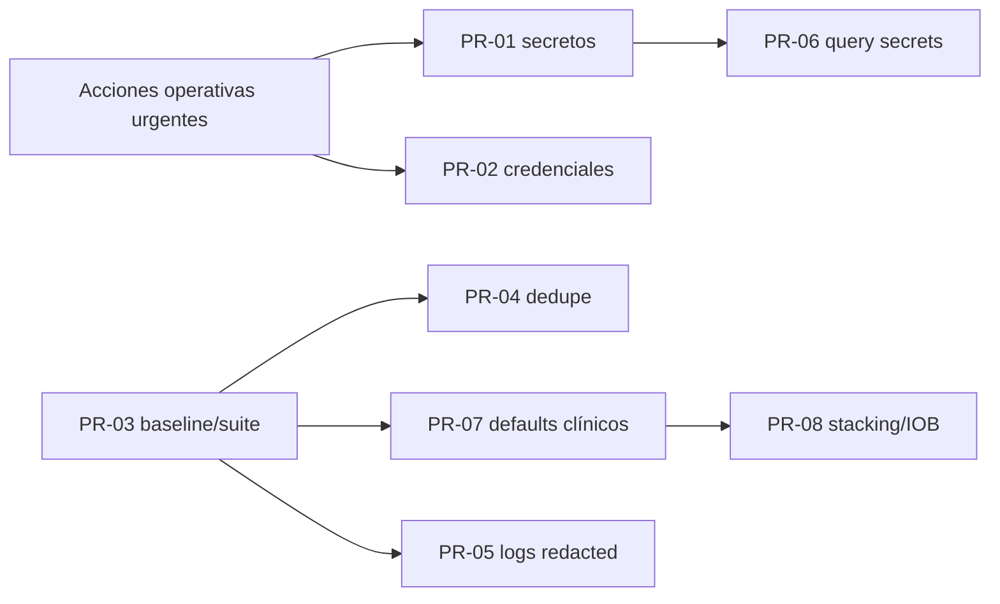

# Plan de remediación prioritaria de Bolus AI (2026)

**Fecha de revisión:** 2026-07-11
**Base:** `docs/audits/FULL_AUDIT_2026.md` y comprobación directa del árbol actual de `main`.
**Alcance:** únicamente los ocho grupos priorizados por Dani.
**Estado:** plan; no se ha modificado código de producción ni configuración de ningún entorno.

> Por seguridad clínica, este plan no cambia fórmulas ni asigna valores universales a ICR, ISF, stacking o IOB. Los cambios que alteren cuándo se puede mostrar una estimación requieren pruebas de caracterización y validación humana. No se eliminará código zombi hasta estabilizar las pruebas críticas y verificar consumidores externos.

## Resumen y orden de ejecución

| Orden | Hallazgo | Severidad | Entorno | Acción inmediata | PR propuesto | Pruebas | Dependencia | Riesgo | Criterio de aceptación |
|---:|---|---|---|---|---|---|---|---|---|
| 0 | Secretos versionados | Crítica/P0 | NAS, Render, BMAX, Android y proveedores | Revocar y rotar fuera de Git; preservar evidencia sin valores | PR-01: saneamiento y prevención de secretos | secret scan, token antiguo rechazado, smoke con nuevos secretos | Ninguna; acción operativa previa al merge | Medio por clientes desincronizados | Ningún secreto real en árbol/historial objetivo; clientes autorizados operativos |
| 1 | Credenciales administrativas por defecto | Crítica/P0 | NAS, Render y desarrollo/BMAX | Cambiar contraseñas/secretos activos y comprobar usuarios | PR-02: bootstrap fail-closed | startup negativo/positivo, login, migración de almacén JSON/SQL | Coordinar con PR-01 para inventario de secretos | Medio-alto por bloqueo de arranque | Producción no arranca con defaults/ausencias; no existe cuenta conocida reutilizable |
| 2 | Pruebas fallidas y errores | Alta/P1 | Varios; principalmente backend/frontend | Congelar despliegues funcionales no urgentes y registrar baseline | PR-03A…03E: estabilización por dominio | 295 pytest, 3 frontend, build; cada sub-PR verde en su dominio | PR-01/02 pueden ir antes; correcciones clínicas posteriores dependen de baseline | Medio | Suite canónica completa verde, sin tests placebo ni exclusiones nuevas |
| 3 | Regresión de deduplicación nutricional | Alta/P1 clínica | NAS, Render, BMAX/Hermes y Android | Monitorizar/evitar reenvíos repetidos; revisión humana de comidas duplicadas | PR-04: dedupe determinista e idempotente | fixtures direct/wrapper/daily dump, DST, concurrencia, equivalencia Hermes | Baseline PR-03; coordinar contrato del webhook | Alto: falso positivo puede perder comida real | Mismo evento no se duplica; comidas distintas no se fusionan; transacción atómica |
| 4 | Payloads clínicos persistidos en logs | Alta/P1 | NAS y Render | Restringir acceso y retención; inventariar/copiar antes de purgar | PR-05: logging mínimo y redacted | asserts de ausencia de macros/texto/secretos, permisos y rotación | Puede ir en paralelo con PR-04 | Bajo-medio: menor diagnóstico | Logs contienen metadatos mínimos, nunca payload bruto ni credenciales |
| 5 | Secretos en query strings | Alta/P1 | NAS, Render, BMAX/Hermes; Android compatible | Dejar de configurar nuevos clientes con `?key=`; localizar consumidores | PR-06: header/bearer only con transición observable | header/JWT válidos, query rechazado, timing-safe, Android/Hermes contract | Rotación PR-01 y consumidor auditado | Medio por clientes legacy | Query key rechazado; Android y Hermes operan por header sin secreto en URL |
| 6 | Defaults clínicos silenciosos | Alta/P1 clínica | NAS, Render, frontend, Telegram/Hermes | Verificar perfil real y procedencia en ambos despliegues | PR-07: contexto clínico explícito/fail-safe | matriz ICR/ISF/target/DIA ausentes o inválidos; contratos canales | Suite verde y perfil de producto definido | Alto: puede bloquear cálculos antes disponibles | Ninguna estimación accionable usa fallback silencioso; respuesta indica procedencia/calidad |
| 7 | Stacking e IOB desactivados | Alta/P1 clínica | NAS, Render, frontend y Telegram/Hermes | Revisar configuración efectiva, no imponer valores universales | PR-08: estado explícito y guardrails configurables | límites, IOB no disponible/stale, bolo reciente, migración settings | PR-07 y validación clínica/producto | Alto: cambios de dosis/flujo | Protección explícitamente configurada o cálculo bloqueado/confirmado; nunca activación silenciosa |

## Principios de implementación

1. Cada PR será pequeño, reversible y sin mezclar cambios de dependencias, limpieza o refactor general.
2. Primero se añaden pruebas de caracterización; después se cambia comportamiento.
3. Los PR clínicos no elegirán parámetros terapéuticos por conveniencia técnica.
4. Las rotaciones de secretos son acciones operativas y no deben depender de que se fusione código.
5. Los valores secretos no se copiarán a issues, commits, logs, documentación ni mensajes.
6. No se eliminará código zombi durante esta secuencia. La verificación de consumidores externos será posterior a la suite verde.

## Acciones manuales urgentes

Estas acciones no son cambios de código y deben ejecutarse mediante los gestores de secretos de cada entorno. Nunca deben pegarse valores completos en Git, terminales compartidos, tickets o este documento.

### A. Contención y rotación de secretos versionados

1. Considerar comprometido el token Nightscout hardcodeado que comienza por `app-7f…` y aparece en seis scripts.
2. Revocarlo en Nightscout antes de limpiar el repositorio. Crear un token nuevo con el mínimo alcance posible.
3. Actualizar de forma coordinada los consumidores legítimos en NAS, Render, BMAX/Hermes y, si aplica, Android. No reutilizar el mismo token entre servicios.
4. Rotar también `NUTRITION_INGEST_KEY/SECRET`, `AGENT_API_TOKEN`, `ADMIN_SHARED_SECRET`, `JWT_SECRET`, `APP_SECRET_KEY`, credenciales PostgreSQL y credenciales Telegram si el inventario operativo demuestra reutilización o exposición.
5. Para `APP_SECRET_KEY`, confirmar antes el procedimiento de recifrado de credenciales Nightscout almacenadas. Rotarla sin migración puede hacerlas ilegibles.
6. Cerrar sesiones JWT activas tras rotar `JWT_SECRET`; comprobar que los tokens anteriores dejan de ser válidos.
7. Revisar logs de Nightscout, reverse proxy, Render, NAS y GitHub para detectar uso del token antiguo sin copiarlo en el informe.
8. Preparar una ventana separada para sanear el historial Git. Reescribir historial requiere coordinación, backup y reclonado de todos los consumidores; borrar solo el fichero actual no revoca el secreto.

### B. Credenciales administrativas

1. Cambiar inmediatamente la contraseña del usuario `admin` en la base SQL activa y verificar si existe un `users.json` legacy con la contraseña bootstrap conocida.
2. Verificar por separado NAS y Render/Neon: no asumir que comparten tabla de usuarios ni hash actualizado.
3. Confirmar que `needs_password_change` no es el único control; una contraseña conocida sigue siendo explotable antes del cambio.
4. Cambiar el password PostgreSQL si alguna instalación llegó a usar el default documentado; actualizar `DATABASE_URL` y reiniciar de forma controlada.
5. Confirmar que ningún despliegue usa el JWT de ejemplo ni la contraseña DB de ejemplo. Si no puede demostrarse, rotarlos.
6. Registrar fecha, propietario y servicios actualizados, pero no el valor de las credenciales.

### C. Mitigaciones operativas clínicas hasta los PR

1. Revisar manualmente las importaciones recientes MyFitnessPal/Health Connect antes de calcular; evitar reintentos automáticos repetidos del mismo dump.
2. Comprobar IOB, último bolo y perfil ICR/ISF/target/DIA directamente en la interfaz fiable antes de aceptar cualquier estimación.
3. Mantener revisión humana obligatoria; no automatizar aceptación ni administración de insulina.
4. Restringir temporalmente el acceso a `DATA_DIR/ingest_logs.json` en NAS/Render. No borrarlo sin copia/criterio de retención y confirmación operativa.
5. No realizar despliegues funcionales no urgentes mientras la suite crítica siga roja.

## 1. Secretos versionados

### Estado y evidencia actual

**Sigue presente: sí, confirmado estáticamente.** El mismo token aparentemente real está asignado como literal en:

- `backend/verify_fix_headers.py:11`
- `backend/test_fix.py:15`
- `backend/test_fix_query.py:15`
- `backend/test_fix_query_no_json.py:15`
- `backend/test_default_sort.py:13`
- `backend/test_sort.py:12`

Algunos de estos scripts también imprimen la variable. `verify_ns_write_hashed.py` puede registrar un hash derivado de un secreto recibido, pero no contiene el mismo literal; se incluye en la revisión preventiva de logging, no como secreto hardcodeado confirmado.

### Entornos afectados

- **Repositorio/GitHub:** exposición confirmada en el árbol actual y probable en historial.
- **Nightscout/NAS/Render/BMAX/Android:** impacto operativo no verificable hasta inventariar qué consumidor usa el token.
- **Varios:** la rotación puede afectar cualquier cliente configurado con él.

### Cambio de código frente a acción operativa

- **Operativo inmediato:** revocar/rotar, inventariar consumidores, revisar accesos y decidir saneamiento de historial.
- **Código (PR-01):** sustituir literales por variables obligatorias; no imprimir tokens; añadir patrones de secret scan y fixtures inequívocamente ficticios; documentación de uso seguro.

### PR-01 — Saneamiento y prevención de secretos

- **Contenido:** seis scripts pasan a `os.environ[...]`/getter seguro y fallan claramente si falta el valor; salidas redacted; secret scanner en CI/pre-commit si se aprueba; no reescribir historial dentro del PR.
- **Reversibilidad:** revertir el PR restaura scripts, pero no debe restaurar secretos ni desrotar credenciales.
- **Pruebas:** ejecución sin env falla sin revelar valores; con token ficticio construye headers esperados; escáner no detecta patrones reales; búsqueda `rg` limpia.
- **Riesgo de rotura:** medio. Los scripts manuales dejan de funcionar hasta configurar env explícitamente.
- **Aceptación:** cero credenciales reales en HEAD, cero impresión completa, secreto antiguo revocado y consumidores legítimos verificados.

## 2. Credenciales administrativas por defecto

### Estado y archivos afectados

**Sigue presente: sí.** Hay dos bootstrap de usuario y dos defaults de despliegue:

- `backend/app/services/auth_repo.py:39-44`: `INITIAL_ADMIN_PASSWORD` cae a una contraseña conocida y se guarda con SHA-256 legacy.
- `backend/app/core/datastore.py:34-47`: `UserStore.ensure_seed_admin()` crea el mismo usuario conocido en `users.json` usando el hasher de aplicación.
- `docker-compose.yml:12`: JWT predecible como default.
- `deploy/nas/docker-compose.yml:66`: password PostgreSQL conocido como default.
- `backend/app/main.py:89-101`: solo advierte sobre secretos débiles; las excepciones de producción están comentadas.
- `render.yaml`: exige `JWT_SECRET` con `sync:false`, pero no define `INITIAL_ADMIN_PASSWORD` ni `APP_SECRET_KEY`; su presencia efectiva es operativa/no verificable.

### Entornos

- **NAS:** SQL bootstrap, Compose, PostgreSQL y startup.
- **Render:** SQL bootstrap y validación de entorno.
- **BMAX/desarrollo:** Compose local y posibles pruebas manuales.
- **Android:** indirecto; el portal usa el login, pero no almacena el bootstrap en el código Android revisado.

### Acciones

- **Operativas:** cambiar cuentas/DB/JWT existentes y comprobar ambos almacenes.
- **Código (PR-02):** eliminar defaults; contraseña inicial obligatoria o bootstrap de un solo uso; usar el hasher canónico; fail-closed con marcador explícito de producción; migrar hashes legacy al autenticar.

### Pruebas y aceptación

- Arranque production sin cada secreto requerido → falla antes de servir health.
- Desarrollo/test requiere opt-in explícito y credenciales ficticias.
- Primera creación admin con secreto aleatorio/inyectado; segundo arranque no sobrescribe cuenta.
- Login legacy migra hash sin cambiar credenciales del usuario; login incorrecto falla.
- SQL y JSON no generan contraseña conocida.
- **Riesgo:** medio-alto por bloqueo de instalaciones incompletas y compatibilidad de hashes.
- **Aceptación:** ningún camino crea credencial conocida ni arranca producción con secretos de ejemplo.

## 3. Regresión de deduplicación nutricional

### Estado y evidencia

**Sigue presente: sí, confirmado en ejecución.** `backend/tests/test_integrations_nutrition.py::test_health_connect_daily_dump_dedupes_against_recent_hermes_meal` esperaba `ingested_count == 0` y obtuvo 1.

El flujo afectado está concentrado en:

- `backend/app/api/integrations.py:574-1260`: parsing, normalización, selección de dump, ventanas y persistencia.
- `backend/app/models/treatment.py`: campos usados para comparar/persistir.
- `backend/tests/test_integrations_nutrition.py`
- `backend/tests/test_integrations_nutrition_autoexport_wrapper_idempotence.py`
- `tests/test_nutrition_ingest.py`
- fixtures `backend/tests/fixtures/payload_*` y `autoexport_wrapper_real.json`.
- Consumidores: `android-companion/.../NutritionIngestClient.kt`, workers Health Connect, `scripts/hermes/mfp_sync_trigger.py` y el sincronizador externo invocado por este último.

La causa exacta necesita una prueba focalizada antes de cambiar lógica. El código usa una clave estricta en `notes` y después una ventana de 30 minutos para eventos con timestamp real, con tolerancias de ±1 g HC y ±0.5 g macros. El caso fallido tiene macros cercanos pero no idénticos y una comida Hermes reciente; por diseño actual no se clasifica necesariamente como duplicado.

### Entornos y acciones

- **NAS/Render:** creación de Treatment/COB.
- **Android/BMAX-Hermes:** productores del mismo evento por canales distintos.
- **Operativo:** detener reenvíos repetidos, auditar duplicados recientes sin borrar automáticamente.
- **Código (PR-04):** normalizador y dedupe como servicio puro; idempotency key estable por fuente y equivalencia cross-source explícita; transacción única.

### Pruebas de regresión

1. Mismo payload directo, wrapper y daily dump repetido N veces → una fila.
2. Hermes seguido de Health Connect equivalente → no duplica; se permite enriquecimiento controlado.
3. Dos comidas reales iguales dentro/fuera de ventana → no se fusionan incorrectamente.
4. Diferencias de redondeo y macros faltantes → matriz aprobada.
5. UTC/Europe-Madrid, cambio DST, timestamp naive/futuro y `force_now`.
6. Dos requests concurrentes → una fila mediante constraint/transacción.
7. Fallo entre insert y notificación → reintento idempotente.

- **Riesgo:** alto: un criterio demasiado agresivo puede ocultar una comida real.
- **Aceptación:** caso rojo pasa, no aparece regresión en comidas repetidas legítimas y existe trazabilidad `created|updated|skipped` sin payload sensible.

## 4. Defaults clínicos silenciosos

### Estado y archivos

**Sigue presente: sí.** Evidencia directa:

- `backend/app/services/bolus_engine.py:162-167`: CR inválido se sustituye por 10 e ISF inválido por 30, devolviendo warning pero continuando.
- `backend/app/services/bolus_calc_service.py:116`: si hay CR directo pero falta ISF, usa 30.
- `backend/app/services/bolus_calc_service.py:121-128`: target/DIA/curve/peak construidos con defaults.
- `backend/app/services/bolus_engine.py:402`: fallback de ISF por slot a 30.
- `backend/app/models/settings.py:10-39,269-290`: defaults de target, CR, CF, DIA y otros parámetros.
- `backend/app/api/agent.py`: perfil descriptivo con valores propios y fallback DB→JSON que puede ocultar un fallo.
- `backend/app/bot/user_settings_resolver.py`: selección/fallback de settings para Telegram.
- Frontend: `frontend/src/modules/core/store.js`, `frontend/src/pages/SettingsPage.jsx`, hooks de cálculo; deben alinearse con el contrato backend.

No se afirma que 10, 30 u otros valores sean clínicamente incorrectos para una persona concreta. El hallazgo es que un dato ausente/inválido puede transformarse silenciosamente en un cálculo numérico aparentemente utilizable.

### Entornos y acciones

- **NAS/Render:** cálculo central.
- **BMAX/Hermes/Telegram/frontend:** presentación y consumo del resultado.
- **Android:** indirecto mediante portal/settings y payloads; su calculadora offline debe auditarse en PR separado si comparte defaults.
- **Operativo:** verificar perfil efectivo y fuente en NAS/Render; no cambiar valores sin validación humana.
- **Código (PR-07):** validación de precondiciones y respuesta de calidad de datos; separar defaults de onboarding de parámetros aptos para cálculo.

### Pruebas

- Matriz por canal (web, Agent, Telegram): ICR/ISF/target/DIA ausente, cero, negativo, NaN, fuera de rango y perfil DB caído.
- Una entrada incompleta no produce estimación accionable; devuelve error/estado estable y warnings estructurados.
- Perfil completo conserva exactamente resultados actuales (golden tests).
- Respuesta incluye fuente/versión de settings y campos usados.
- Fallback legacy solo funciona con opt-in explícito y queda marcado.

- **Riesgo:** alto: puede bloquear flujos hoy tolerados o alterar compatibilidad.
- **Aceptación:** ningún cálculo clínico utiliza defaults silenciosos; cualquier fallback visible requiere confirmación/revisión humana y queda trazado.

## 5. Protecciones de stacking e IOB desactivadas

### Estado y archivos

**Sigue presente: sí.** No significa que el motor ignore siempre IOB: la protección existe, pero está apagada si no se configura.

- `backend/app/models/settings.py:278-279`: `max_iob_u=None` y `min_bolus_interval_min=0`.
- `backend/app/dtos/math_models.py:61-62`: mismos defaults internos.
- `backend/app/services/bolus_engine.py:297-325`: guardrails solo se ejecutan si valores >0/no nulos.
- `backend/app/services/bolus_engine.py:441-442`: fallbacks vuelven a `None/0`.
- `backend/app/services/bolus_calc_service.py`: resolución de IOB/COB y confirmación cuando no están disponibles.
- `frontend/src/pages/BolusPage.jsx` y `frontend/src/components/bolus/ResultView.jsx`: confirmación/visualización.
- `backend/app/bot/service.py`, `backend/app/bot/tools.py`: flujo Telegram de cálculo/aceptación.
- Tests relevantes: `test_iob.py`, `test_iob_confirm.py`, `test_bolus_overrides.py`, `test_bolus_calc.py`, `test_bolus_v2.py`, `test_agent_api.py`.

### Entornos y decisión clínica

- **NAS/Render:** motor y settings.
- **Frontend/Telegram/Hermes:** interacción y warnings.
- **Android:** la calculadora offline (`BolusCalculator.kt`, `BolusProfile.kt`) necesita una comprobación de paridad, pero no debe modificarse dentro del mismo PR backend.

No se propone un máximo de IOB ni intervalo universal. Es una **decisión de producto con validación clínica**: exigir configuración individual, bloquear si falta, o mantener modo desactivado pero hacerlo explícito y exigir confirmación.

### PR-08 — Guardrails explícitos

- Añadir estado `configured/enabled/disabled_by_user/unavailable`, no inferido de `0/None`.
- Migración conservadora: no activar automáticamente una cifra nueva a usuarios existentes.
- Mostrar en respuesta/UI qué protección se aplicó y el dato de último bolo/IOB usado.
- Separar IOB no disponible, IOB stale y IOB=0 real.
- **Pruebas:** techo justo por debajo/igual/encima; último bolo en límites; IOB stale/ausente/cero; doble request; redondeo después del cap; Agent no persiste; golden de configuraciones actuales.
- **Riesgo:** alto por cambio potencial en dosis o bloqueo.
- **Aceptación:** nunca se presenta una protección desactivada como activa; ausencia de configuración produce estado explícito y conducta aprobada, no un fallback silencioso.

## 6. Secretos aceptados en query strings

### Estado y archivos

**Sigue presente: sí.** `backend/app/api/integrations.py:648-662` obtiene `request.query_params.get("key")` si no hay header y compara con `==`.

Archivos/consumidores:

- Backend: `backend/app/api/integrations.py`.
- Tests: `backend/tests/test_integrations_nutrition.py`, `tests/test_nutrition_ingest.py`, `backend/tests/test_mobile_bolus_events.py`.
- Android: `NutritionIngestClient.kt` ya usa `X-Ingest-Key`; no necesita query string.
- BMAX/Hermes: `scripts/hermes/mfp_sync_trigger.py` valida header para su endpoint, pero el script externo `sync_to_bolus.py` está fuera del repositorio y debe verificarse operativamente.
- Scripts: `scripts/verify_webhook_auth.sh` y documentación `docs/INTEGRATIONS_NUTRITION.md`, `docs/HERMES_MYFITNESSPAL_BOLUS_SYNC.md`.

### Acciones y PR-06

- **Operativo:** buscar URLs con `?key=` en BMAX, cron/systemd, proxy y logs; migrar consumidores a header antes de retirar compatibilidad.
- **Código:** telemetría temporal sin secreto para contar uso de query; fase 1 warning/deprecation, fase 2 rechazo. Usar bearer JWT o `X-Ingest-Key` con `hmac.compare_digest`; rate limit y longitud mínima.
- **Pruebas:** header correcto 200; bearer correcto 200; ausente/incorrecto 401; query correcto 401/400 tras corte; secreto nunca aparece en logs; comparación segura; contratos Android y Hermes.
- **Riesgo:** medio por consumidores externos no visibles.
- **Aceptación:** ningún endpoint acepta secretos por URL y todos los consumidores conocidos usan headers.

## 7. Payloads clínicos sensibles persistidos en logs

### Estado y archivos

**Sigue presente: sí.** `backend/app/api/integrations.py:603-617` asigna el body completo a `log_entry["payload"]`; `append_log()` escribe hasta 50 objetos en `DATA_DIR/ingest_logs.json` mediante `DataStore`.

También afectan:

- `backend/app/services/store.py`: lectura/escritura JSON y permisos heredados.
- `backend/app/api/integrations.py:1312+`: endpoint autenticado de consulta de logs.
- `frontend/src/pages/StatusPage.jsx` o consumidores de logs de integración, a verificar por referencias.
- Volúmenes `DATA_DIR` en Compose NAS y disco Render.
- Backups que incluyan el data dir pueden conservar copias más allá de las 50 entradas.

### Entornos y acciones

- **NAS/Render:** persistencia principal.
- **BMAX/Android:** productores, no persistencia directa en este código.
- **Operativo:** restringir permisos/acceso, identificar backups y definir retención; no borrar sin autorización y copia si hace falta para el incidente.
- **Código (PR-05):** esquema de log allowlist: request ID, timestamp, fuente normalizada, wrapper, grupos/recuentos, resultado e IDs; hashes no reversibles solo si necesarios; nunca texto de comida, macros individuales, headers o body bruto.

### Pruebas

- Payload canario con nombre de comida/timestamps/macros/secreto: ninguno aparece en fichero, respuesta o logs de aplicación.
- Se mantienen datos suficientes para diagnosticar created/updated/skipped.
- Rotación/retención y permisos `0600` o equivalentes del volumen.
- Endpoint de logs aplica auth y devuelve solo esquema redacted.
- Error antes/después de autenticación no persiste body.

- **Riesgo:** bajo-medio por pérdida de detalle diagnóstico.
- **Aceptación:** inspección automática del fichero y backup nuevo sin datos clínicos brutos; runbook de retención aprobado.

## 8. Pruebas fallidas y errores de ejecución

### Estado actual reproducido

**Sigue presente: sí.** Ejecución aislada:

- Pytest: 295 recogidas, 284 pasan, 7 fallan, 3 errores, 1 omitida.
- Frontend: dos scripts pasan y `frontend/tests/simulation_payload.test.js` falla.
- Build Vite pasa con warnings de chunking.

### Inventario completo de fallos y archivos

| Dominio | Prueba | Estado/causa observada | Producción afectada | PR reversible |
|---|---|---|---|---|
| Restaurante | `backend/tests/test_api_restaurant.py` (2) | tests envían form; ruta `ComparePlateRequest` espera JSON y devuelve 422 | `api/restaurant.py`, cliente `restaurantApi.js` | PR-03A: fijar contrato, preferiblemente ajustar test si cliente actual usa JSON; no soportar ambos sin evidencia |
| Telegram snapshots | `test_bot_callbacks_recalc_context.py` (3 errores), `test_bot_tools.py`, `tests/test_bot_exercise.py` | tests esperan `service.SNAPSHOT_STORAGE`, producción usa `snapshot_store.py` | bot service/tools/snapshot store | PR-03B: migrar tests a interfaz real y confirmar callbacks; si producción falla, corregir implementación con caracterización |
| Forecast onset | `test_forecast_onset.py` | bolo actual offset 0 muta a +15 | `api/forecast.py`, `services/forecast_engine.py`, modelos forecast | PR-03C: decidir contrato clínico y evitar mutación inesperada |
| Nutrition dedupe | `test_integrations_nutrition.py` | crea 1 evento equivalente | `api/integrations.py` | PR-04 específico, no mezclar con otros fallos |
| Nightscout serialización | `test_mobile_glucose_entry.py` | JSON semánticamente igual, espacios distintos | `nightscout_client.py`/test | PR-03D: comparar JSON semántico; no cambiar wire payload solo por whitespace |
| Frontend simulación | `simulation_payload.test.js` | faltan bolos históricos+actuales esperados | `bolusSimulationUtils.js`, `useBolusSimulator.js`, `ForecastPage/BolusPage` | PR-03C junto al contrato forecast, manteniendo commit separable frontend |
| Runtime warnings | basal/evaluation/nightscout/settings/suggestions tests | `AsyncMock` usado donde `db.add` es sync | varios tests/servicios | PR-03E: corregir mocks y convertir warnings en error de CI gradualmente |
| SQLite migration logs | startup de tests | `ADD COLUMN IF NOT EXISTS` incompatible en SQLite | `core/db.py`, `core/migration.py` | fuera de los ocho salvo que impida suite; caracterizar en PR-03E sin rediseñar migraciones |

### Estrategia

1. No “arreglar” producción para satisfacer un test obsoleto sin verificar el consumidor real.
2. Para restaurante y snapshots, determinar primero si la regresión está en test o runtime mediante TestClient/cliente frontend/callback simulado.
3. Para forecast y dedupe, tratar los tests como alarmas clínicas: no cambiar expectativas sin revisión explícita.
4. Añadir todos los tests frontend al script canónico y fijar `testpaths` para que pytest no recoja scripts diagnósticos por accidente.
5. No añadir `skip`, `xfail` o exclusiones para obtener verde salvo dependencia externa documentada.

### Criterio de aceptación global

- 295/295 pruebas aplicables pasan o el único skip existente queda justificado; ningún error de setup.
- Las tres pruebas frontend están en `npm test` y pasan; build pasa.
- No hay nuevos warnings de coroutines no awaited.
- Cada corrección incluye prueba que falla antes y pasa después.
- No cambian resultados clínicos golden salvo PR etiquetado y validado.

## Dependencias entre PR y rollback

- **Rollback PR-01/02:** restaurar mecanismo anterior solo en desarrollo aislado; nunca restaurar secretos revocados.
- **Rollback PR-04:** feature flag temporal al algoritmo anterior, conservando constraint/idempotency data; revisar filas creadas durante ventana.
- **Rollback PR-05/06:** mantener soporte antiguo por ventana limitada únicamente si consumidor confirmado lo exige; no volver a registrar secretos/payloads.
- **Rollback PR-07/08:** volver al comportamiento caracterizado con warning fuerte, no introducir parámetros terapéuticos nuevos.

## Verificación de alcance

- Se confirmó evidencia directamente en el código actual para los ocho hallazgos.
- Todos siguen presentes en la versión revisada.
- No se modificó código de producción ni configuración.
- No se rotaron secretos ni se accedió a gestores de credenciales; esas tareas quedan listadas como acciones manuales.
- No se muestran valores secretos completos.
- No se propone eliminar código zombi antes de estabilizar pruebas y verificar consumidores externos.
